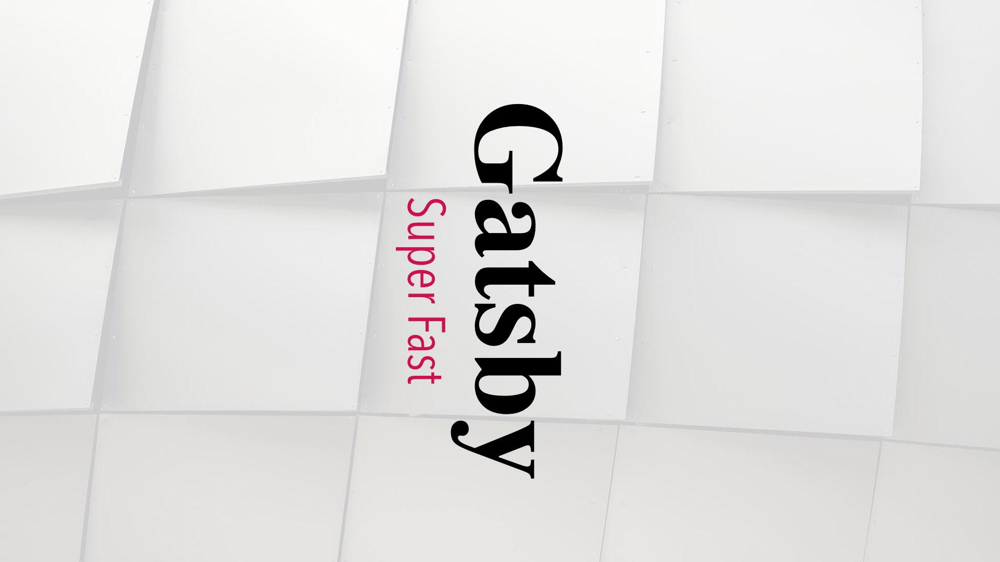
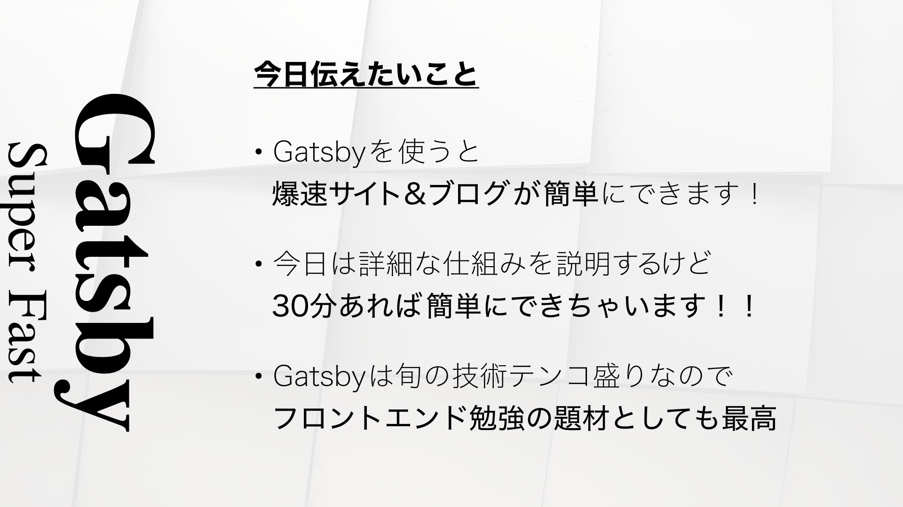
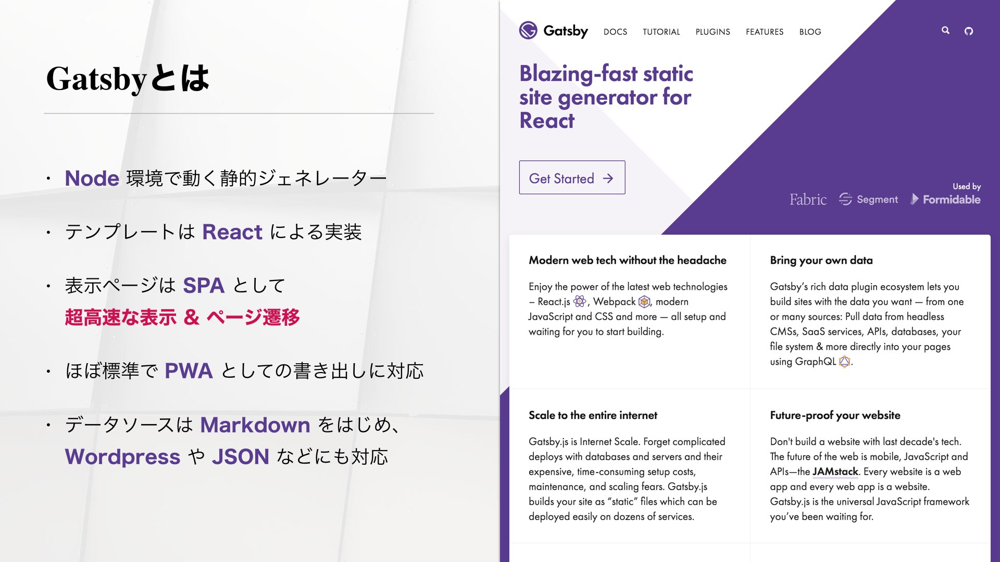
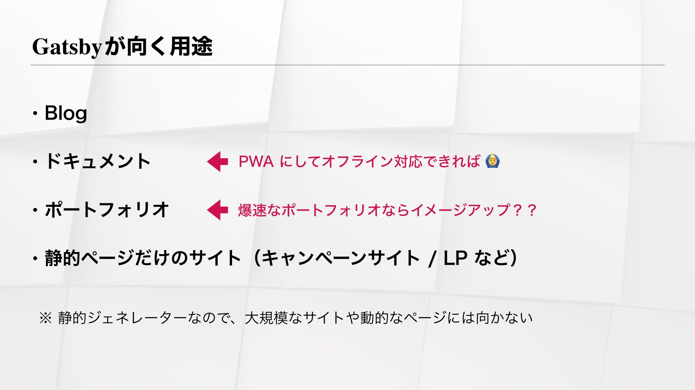
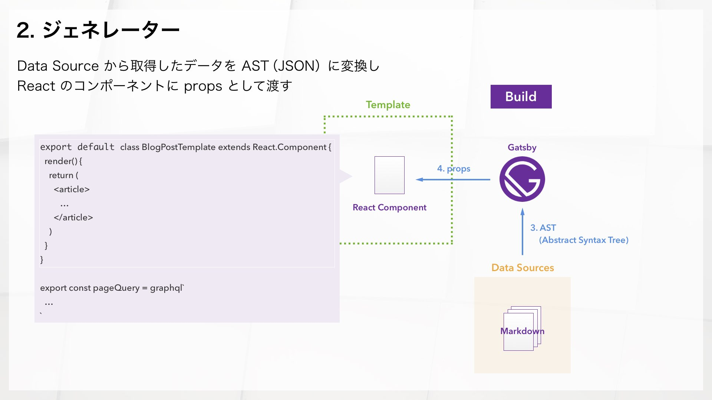
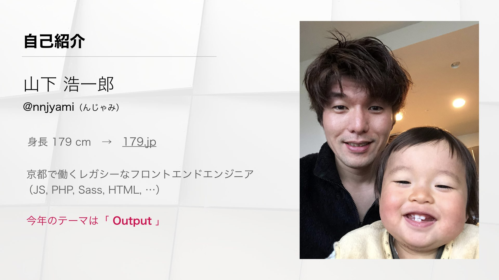
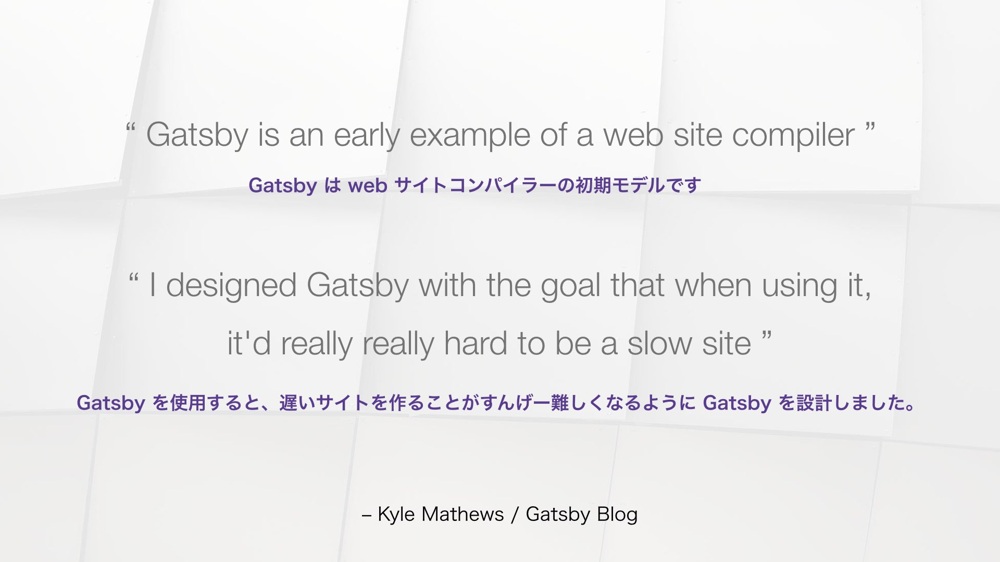

週末初めての登壇ができ、結果も予想以上な大成功&達成感で燃え尽きている nnjyami（んじゃみ）です。

今年の目標の一つが外部での登壇 2回だったので、すでに進捗 50%！  
ブログメンター [@kakakakakku](https://twitter.com/kakakakakku?lang=ja) さんに背中を押してもらい、空気を読まずに [Kyoto.js](https://kyotojs.connpass.com/event/80019/) に申し込んでホント良かった。  
申し込んで登壇するまで、[@kakakakakku](https://twitter.com/kakakakakku?lang=ja) さんには登壇メンター的なこともしてもらい、感謝です！！
まさに、アウトプットメンター。

登壇に際して、[@kakakakakku](https://twitter.com/kakakakakku?lang=ja) さんからいただいた、ブログ2本を繰り返し読んで参考になった！登壇控えている方は是非読んでみてください。
- [個人的な Keynote ベストプラクティス 2017](http://kakakakakku.hatenablog.com/entry/2017/05/30/092247)
- [プレゼンをするときに意識していること](http://kakakakakku.hatenablog.com/entry/2017/05/08/085023)

## はてブホットエントリーに入って、2487Viewもらった

Kyoto.js に参加されてる方、僕の前に登壇されていた方々の技術力がとてもとても高そうだったので、「僕、デザイン寄りです」とか言い訳しながら登壇した。
登壇自体は、[@kakakakakku](https://twitter.com/kakakakakku?lang=ja) メソッドに基づいて練習したこともあり、まあまあな出来だったと思う。
もう少し気持ちに余裕を持って、ゆったり話すことが反省点。

登壇前から、#kyotojs が Twitter のトレンドに入ったりしてたので注目されてたのかも。  
登壇後、スライドを上げていた Speaker Deck がはてブホットエントリーに入って、テクノロジー部門で**最高 3位**くらいまで行った！  
Speaker Deck の方も 2500View 近くになっており、想像以上のパーフェクトな登壇結果を残せたと思う。

KyotoJSの参加者が 30人ほどだったので、最終的に 83倍の人に届けられたと思うと出来過ぎ。

また、僕の一つ後の sotayamasita さんによる「Introduction to JAMStack」が Gatsby とも関係する内容でとても面白く、 JAMStack のような文脈というかトレンドも盛り込めたなら、より説得力のある資料になるなと思った。  
JAMStack に関しては、もう少し色々調べて（sotayamasitaさんもとことん教えてくれるらしい）ブログに書きたいと思う。

## 発表内容の振り返り

[登壇資料 / Gatsby Super Fast](https://speakerdeck.com/nnjyami/gatsby-super-fast)  
※ Gatsby だと SpeakerDeck のスライドを Embed する方法が見つけられてない

登壇の内容自体はここ最近ブログに書いていた GatsbyJS について。  
アメリカとかでは人気があるようだけれど、日本であまり知名度がない。技術的にも過剰なほど前ノメリな感じが気に入っている。

KyotoJS主催者の @amagitakayoshi さんに「Gatsby って @amagitakayoshi さん界隈だと今さらな感じですか？」と不安になって聞いたりしてた。
結果的には、全然大丈夫そうな印象だった。情熱を持って伝えられることなら、ムダなことはないのかもしれない。

スライドには「今日伝えたいこと」というスライドをはじめと終わりに入れている。  
これは @kakakakkaku さんからフィードバックをもらって入れたんだけど、これがあることによって自分自身の中でも伝えたいコンセプトが明確になったし、見る人にとってもよりわかりやすいものになったのではと思う。

また実演というか、体験してもらうこともスライドの中に入れておくことで、しっかり体験してもらえた。  
登壇で緊張してたりすると、ついつい言うつもりでいたことを忘れたりする。  
「Gatsby 知っている人？」と聞くつもりが、すっかり抜けていた。

会場で「おぉ〜」って声漏れたりするかと思いきや、静かだったけど、Twitteでは「おお、遷移速い！」「速い!!」「Gatsbyめっちゃ面白そう。http://dvg.179.jp で速度体験してビビった。」とコメントいただいていてホッとした。
ちなみに「ちゃんと体感してもらいましょう」というのも @kakakakkaku 先生からいただいたフィードバック！

Gatsby のことについては、ここ2ヶ月弱ほどまとめてきて、ある程度わかりやすく伝えられたのではと。
Starter の種類とかも伝えようかとも思ったけど、技術的な勉強会だし仕組みなどの説明を優先した。  
Gatsby が向く用途というスライドも好評だったように思う。  

今回、内容はある程度固まっていたので、図を Sketch で割と丁寧に描いた。  
やっぱり図示するとわかりやすさが全然違う。  
必ずしもわかりやすく伝えることが大事ではないけど、会社でも割とそこが得意な気がする。

## 反省点

これは今さら感はあるけれど、僕のハンドル名 nnjyami（んじゃみ） が読めない問題。  
iPod に付けた名前が由来で、意味は特にない。  
iTunes で名前をつけろと言われて、真剣に考え、普通ではありえない「ん」で始まる名前を考えた結果思いついたもの。

ちなみに自己紹介スライドの写真、息子と顔を並べると、僕の顔があまりに色が悪かったのでレタッチしました。

## これから

このスライドは、Gatsby の作者 Kyle Mathews さんの言葉を抜粋したもの。  
Gatsby がどういうものかわかりやすい言葉をピックアップした。

最近は JS でもなんでもコンパイルして、最終的なパフォーマンスや後方互換性を維持する。  
Web サイトコンパイラーはサイト全体に対して、そのようなコンパイルをするというコンセプト。
今後のトレンド・方向性としてありうるなぁと思っていたのだけれど、前述の通り JAMStack というニューワードを教えてもらい、Gatsby からさらに深めていけそうな方向性を発見した。

Web に関していうと、新しさと速さ（パフォーマンス）は常に正義だと信じている。  
その方向性を推し進められるような何かをしたい。

登壇すると、名刺交換とか必要ないくらい覚えてもらえるのでとてもイイ。  
参加するだけだと、その他大勢の一人でしかないので。  
継続的に登壇できるように、予定を入れていかないと！