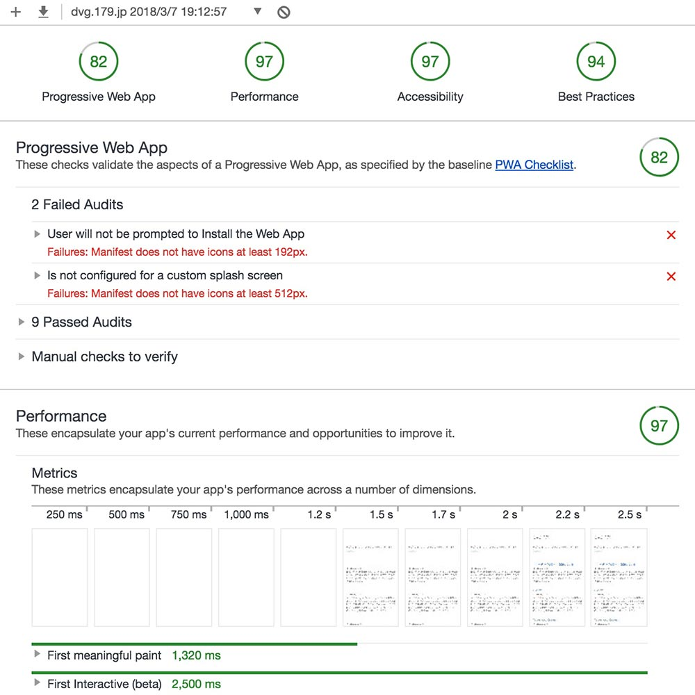

このブログは GatsbyJS という静的ジェネレーターで作成している。  
[前回](/gatsby/)までも Gatsby を使ったブログ制作環境について書いてきたけど、ドキュメントなど読み進めて、だいぶわかってきたので色々とカスタマイズを始めている。

今週、[Hello World! Progressive Web-Blog!!](https://blog.uskay.io/article/001-pwa-blog-loading) という Google の [@uskay](https://twitter.com/uskay) さんのブログがはてブに上がっていた。「Progressive Web-Blog」ってキャッチーで、いい言葉だと思う一方、ライバルな感じもしてじっくり読ませてもらった。 Gatsby はまさに Progressive Web-Blog を作るのには打ってつけのジェネレーターなので。

## Progressive Web-Blog
前述の [@uskay](https://twitter.com/uskay) さんの[ウェブボウズ](https://blog.uskay.io/)は、Web Components + Service Worker + Firebase + [PRPL Pattern](https://developers.google.com/web/fundamentals/performance/prpl-pattern/?hl=ja) で Progressive Web App（PWA） 化して、すんごいパフォーマンスのブログを実現されている。  
Service Worker のキャッシュを考慮しても、「Web Components ってパフォーマンスもいいのか」とビックリした。Chrome の Audits のスコアを見ても、ほぼ満点なスコア...。

しかし、Web Components の書き方を見てると HTML の拡張というよりは、 JS がメインで書き方が React とそんなに変わらない。  
JSX を使わず、テンプレートリテラルで書いてるだけで、ほぼ似たような書き方に見える。動的に書き替えないようなサイトなら、Web Components は React 使わずに組めて、いい感じな気がする。

### Gatsby で Progressive Web-Blog
Gatsby 自体に Service Worker がデフォルトで入っているので、SSL 環境で公開さえすれば（または localhost） Service Worker が動く。  
DNS の設定を置いている Cloudflare を設定変更して、この dvg.179.jp も SSL に入れて、Service Workerが有効にできた。
Gatsby 側の Service Worker 設定をするところが見つからないので、細かな設定はできていないけど、とりあえず PWA 化に向けて一歩前進。

### DNSによるSSL化
VPS に SSL 証明書インストールして、nginx の設定して…とかハードル高いとビビってたけど、DNS側だけで SSL にできてしまえるのは便利。
実際には DNS からサーバー間は平文での通信かもしれないので、ホントのプロダクションでは推奨されない方法なのかもしれない。

### Gatsby 側での追加設定
現在このブログは [gatsby-starter-blog](https://github.com/gatsbyjs/gatsby-starter-blog) という starter ≒ テーマ を使用している。
この starter の場合、PWA に必要な Web App Manifest が出力されない。  

ただ対応は簡単で、Gatsby 作者が公開している [gatsby-plugin-manifest](https://www.npmjs.com/package/gatsby-plugin-manifest) を追加すればいい。
gatsby-config.json に必要な項目を追記して `gatsby build` すると manifest.json が出力されるようになり Google の [PWA チェックリスト](https://developers.google.com/web/progressive-web-apps/checklist)でも合格点をもらえる PWA を出力できる。
  

`gatsby-config.js（一部抜粋）`

```js
module.exports = {
  plugins: [
    {
      resolve: `gatsby-plugin-manifest`,
      options: {
        name: "dvg - 179",
        short_name: "dvg 179",
        start_url: "/",
        background_color: "#e2e22d",
        theme_color: "#e2e22d",
        display: "minimal-ui",
        icons: [
          {
            src: `/favicons/profPig.jpg`,
            sizes: `180x180`,
            type: `image/jpg`,
          },
          /*
          // ホントはこの二つを設定する
          {
            src: `/favicons/icon-192x192.png`,
            sizes: `192x192`,
            type: `image/png`,
          },
          {
            src: `/favicons/icon-512x512.png`,
            sizes: `512x512`,
            type: `image/png`,
          },
          */
        ],
      },
    },
  ]
}
```

  
現状、僕のアイコンのブタの元画像が見つけられなくて、大きなアイコンを作れないので PWA が 82点止まり。  
体感的には圧倒的には速い Gatsby だけど パフォーマンスのスコアが 97点なのもちょっと不満。現時点ではウェブボウズさんに完敗なのが悔しい！PWA はイイとしてもパフォーマンスのスコア（ウェブボウズさん：98）で負けているのは悔し過ぎる。

今後全部満点取れるようなカスタマイズをしていきたい。目指せハイパフォーマンス・ブログ。  
ついに iOS にも次期11.3から Service Worker が来る（ Beta では公開済み）ので、今年は Service Worker → PWA 究極のハイパフォーマンスサイトがどんどん盛り上がりそう。



  

## カスタマイズに着手した！
PWA 化と並行して、Gatsby の[ドキュメント](https://www.gatsbyjs.org/docs/)や Starter のコードを覗き、まずは最低限のカスタマイズにも着手した。
やりたいことは色々とあるけれど、今回はまず以下の2点だけ実施した。
- SNSシェアボタン設置
- OGPの追加


## SNSシェアボタン
シェアボタンは、(Hatch tech blog)[http://hachibeedi.github.io/] さんや Gatsby の Starter のソースを参考にした。（というかほぼそのまま）

Twitter や Facebook などのグローバルなサービスに関しては、React-share というモジュールがデフォルトで、簡単にボタンが設置できる。ソースを見た Starter もほぼその実装だった。

はてブを React-share に組み込み PR を目指そうかとも思ったけど、とりあえず簡単に組み込める方法にとどめた。  

`src/components/ShareBtn/ShareBtn.jsx（一部抜粋）`

```jsx
import React from 'react'
import Helmet from 'react-helmet'

import './ShareBtn.css'

export default function SNSShare({title, link}) {
  return (
    <ul className="snsShare">
      <Helmet>
        <script type="text/javascript" src="//b.st-hatena.com/js/bookmark_button.js" charset="utf-8" async="async" />
      </Helmet>

      <li className="snsShare_unit">
        <a
          href="http://b.hatena.ne.jp/entry/"
          className="hatena-bookmark-button"
          data-hatena-bookmark-layout="vertical-normal"
          data-hatena-bookmark-lang="ja"
          title="このエントリーをはてなブックマークに追加"
        >
          
        </a>
      </li>
    </ul>
  )
}
```

Gatsby 自体に Style-loader が入っているので、JSファイルで直接読み込める。
スタイルはホントは Scss で書きたいけれど、変換が面倒なのでコンポーネントごとに css で書き読み込んでいる。  

コンポーネントごとに CSS ファイル置いて、ディレクトリにまとめておくと、依存関係もわかりやすいし、とても使い勝手がいい。  
まさにコンポーネント思考そのもの。

## React Helmet
シェアボタンの設置自体はシンプルだけど、合わせてOGP の設定も必要で、こちらの方が少しややこしい。

Gatsby の魅力の一つは静的なページに書き出した後、ブラウザでの表示が SPA（実際はPWA） になること。  
ただ SPA の場合、記事の詳細ページを表示した際に OGP(Open Graph protocol) などの書き替えが必要になる。    
そんな時、どこからでも `<head></head>` 内を書き替えれるのが `React Helmet` という便利なモジュール。

`src/components/Meta/Meta.jsx（一部抜粋）`

```jsx
import React from 'react'
import Helmet from 'react-helmet'

export default function Meta({postNode, postPath}) {
  return(
    <Helmet>
      <meta property="og:url" content={url} />
      <meta property="og:type" content="article" />
      <meta property="og:title" content={title} />
      <meta property="og:description" content={description} />
      <meta property="og:image" content={ProfPig} />
    </Helmet>
  )
}
```

みたいな感じで、どこにでも好きなところに書いたら、最終的に `<head>` 内に出してくれる。  


## 今、次の課題
SNS シェアボタンは設置できたけれど、ブログ全体のスタイルを触ろうと思うと、僕が使っている [gatsby-starter-blog](https://github.com/gatsbyjs/gatsby-starter-blog) はカオス感がある。  
 [typography.js](https://kyleamathews.github.io/typography.js/) と各 React コンポーネントのスタイル定義が入り混じっている箇所が多く、どこでスタイルが定義されているのか見通しが悪い。

gatsby-starter-blog からスタイル定義を抜いた [starter](https://github.com/noahg/gatsby-starter-blog-no-styles) がコミュニティで公開されている。たぶん、大体の人にとって typography.js + 直スタイル定義がわかりにくいのではと予想する。

ようやく作法的なものがわかってきたので、もう少し深く触っていこうと思う。
次回以降、Gatsby starter の比較とか、カスタマイズ関連、Audits スコアアップとか書いて行く予定！
