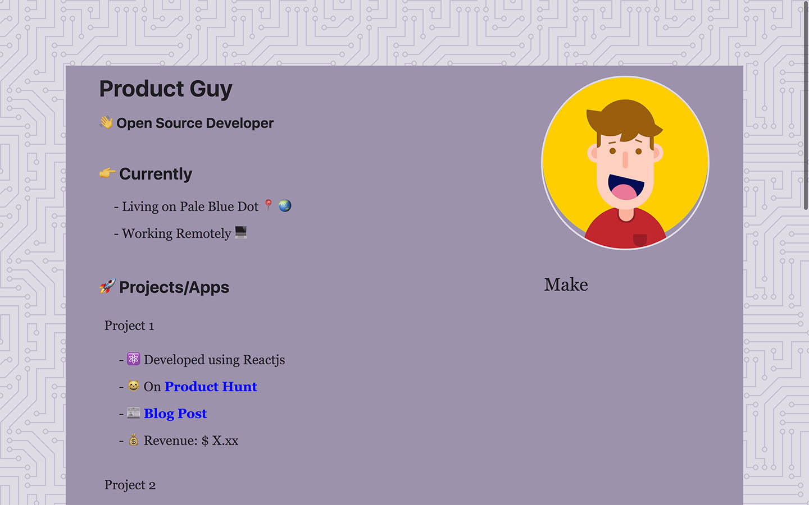
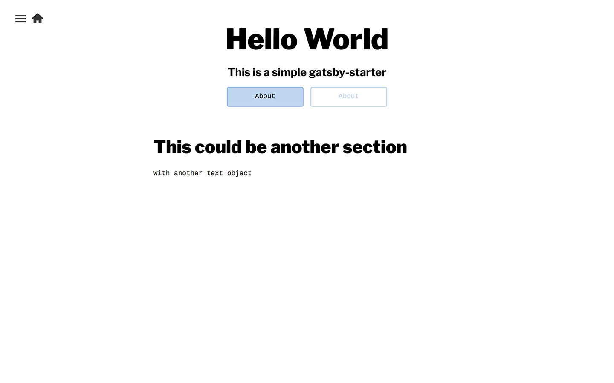

絶賛研究中の GatsbyJS という Node/React 製の静的ジェネレーター。  
今回は GatsbyJS のテーマ的なものも兼ねている Starter について書いてみる。

## Starterとは
GatsbyJS は、はじめに構築する際にブログ（サイト）テーマ・テンプレートを選び構築する仕組みになっている。  
その際に Starter というのがオフィシャル&コミュニティより提供されていて、それがテーマ・テンプレートの初期状態となる。

後からテーマを変更することはできなくはないが、Wordpress とかみたいに簡単にできるわけではない。  
コンテンツデーターを保存する `/src/pages` 以外を上書きしてしまえば、なんとかなるがサイトの設定や Gatsby の設定など Starter により違ったりするので単純に差し替えるだけでは、上手くビルドできない場合がある。  
はじめの段階でフルスクラッチ的に作成するのか、ある程度既存のスタイルに載せるのかくらいは決めて Starter を選ぶ方がイイ。


## Starterの種類
Starter は大きく分けると本家が作った Official 3種類と Community が作った30種類以上の Starter に分けられる。
自作することも可能で PR すればオフィシャルのドキュメントからリンクしてもらえる模様。

Starter の中でも、ブログ用のものや一般的なサイト作成用のもの、ポートフォーリオ用のものなど様々。  
また TypeScript を用いた Starter や Firebase 連携・ Netlify 連携など技術・環境切り口の種類も豊富にある。

## おすすめ Starter 2選
全ての Starter に目を通したわけではないのが、Official と Community からひとつずつオススメ Starter を選んでみた。  
選ぶ基準としては、わかりやすいコードかどうか、拡張性というところを重視している。

### Official - gatsby-starter-default
  

スタイルや機能をフルフルでカスタマイズする前提なら、必要最低限の機能が入った Official を選ぶメリットがあるかも。  
Official Starter からひとつ選ぶとすると [gatsby-starter-default](https://github.com/gatsbyjs/gatsby-starter-default) をオススメする。
Official の中では Style 周りの余計な設定が入っていないので、カスタマイズしやすいのがメリット。

Official の Starter はどれも元々入っている機能が必要最低限に絞られているのも特徴。  
しかしながら、豊富な [Gatsby のプラグイン](https://www.gatsbyjs.org/packages/) が提供されているので、後から簡単に追加することができる。

スタイルを全て書く意気込みであれば、Community で作成されている Official から Style を抜いた [gatsby-starter-blog-no-styles](https://github.com/noahg/gatsby-starter-blog-no-styles) もオススメ。ただ、no-styles の Starter は常にキャッチアップしてる感じでもないので、少し古い実装である場合がありそう。

前にも書いたけど、Official のスタイル定義は単純に CSS ではなく、React コンポーネントの所々で上書きされていたりするので非常にわかりにくい。
僕は gatsby-starter-blog をはじめに入れてしまって、後悔している。結局 gatsby-starter-blog-no-styles で今作り直している。


### Community - gatsby-starter-casper
  

Community の中で選ぶと、[gatsby-starter-casper](https://github.com/haysclark/gatsby-starter-casper) が完成度が非常に高くて、かつコードの構造もきれいなのでオススメ。  
大きなメイン画像が毎回必要なところに好き嫌いはあるかもしれないけれど、大体の必要なものは揃っていそうな気がした。

Gatsby がより知名度を得るためにも、魅力的な Starter って大切だと思うので、今後もウォッチしつつ、機会があれば自分でも作ってみたいと思っている。


## Starter 一覧
せっかくなので、Headless Chromeを使って、Starterデモページのキャプチャーを集めてみた。  
一見の価値ありな Starter には ★印を付けた。Starter 選びの際の参考にしてもらえたら嬉しい。 

<div class="starterListWrap">

<div class="starterList">
<a href="https://github.com/gatsbyjs/gatsby-starter-default" target="_blank">★ gatsby-starter-default</a><br />
<a href="http://gatsbyjs.github.io/gatsby-starter-default/" target="_blank">[DEMO]</a>

</div>

<div class="starterList">
<a href="https://github.com/gatsbyjs/gatsby-starter-blog" target="_blank">gatsby-starter-blog</a><br />
<a href="http://gatsbyjs.github.io/gatsby-starter-blog/" target="_blank">[DEMO]</a>

</div>

<div class="starterList">
<a href="https://github.com/gatsbyjs/gatsby-starter-hello-world" target="_blank">gatsby-starter-hello-world</a><br />
<a href="https://aberrant-fifth.surge.sh/" target="_blank">[DEMO]</a>

</div>

<div class="starterList">
<a href="https://github.com/noahg/gatsby-starter-blog-no-styles" target="_blank">★ gatsby-starter-blog-no-styles</a><br />
<a href="http://capricious-spring.surge.sh/" target="_blank">[DEMO]</a>

</div>

<div class="starterList">
<a href="https://github.com/Vagr9K/gatsby-material-starter" target="_blank">gatsby-material-starter</a><br />
<a href="https://vagr9k.github.io/gatsby-material-starter/" target="_blank">[DEMO]</a>

</div>

<div class="starterList">
<a href="https://github.com/fabien0102/gatsby-starter" target="_blank">gatsby-typescript-starter</a><br />
<a href="https://fabien0102-gatsby-starter.netlify.com/" target="_blank">[DEMO]</a>

</div>

<div class="starterList">
<a href="https://github.com/jaxx2104/gatsby-starter-bootstrap" target="_blank">gatsby-starter-bootstrap</a><br />
<a href="https://jaxx2104.github.io/gatsby-starter-bootstrap/" target="_blank">[DEMO]</a>

</div>

<div class="starterList">
<a href="https://github.com/dschau/gatsby-blog-starter-kit" target="_blank">gatsby-blog-starter-kit</a><br />
<a href="https://dschau.github.io/gatsby-blog-starter-kit/" target="_blank">[DEMO]</a>

</div>

<div class="starterList">
<a href="https://github.com/haysclark/gatsby-starter-casper" target="_blank">★ gatsby-starter-casper</a><br />
<a href="https://haysclark.github.io/gatsby-starter-casper/" target="_blank">[DEMO]</a>

</div>

<div class="starterList">
<a href="https://github.com/Vagr9K/gatsby-advanced-starter" target="_blank">gatsby-advanced-starter</a><br />
<a href="https://vagr9k.github.io/gatsby-advanced-starter/" target="_blank">[DEMO]</a>

</div>

<div class="starterList">
<a href="https://github.com/100ideas/glitch-gatsby-starter-blog/" target="_blank">glitch-gatsby-starter-blog</a><br />
<a href="https://gatsby-starter-blog.glitch.me" target="_blank">[DEMO]</a>

</div>

<div class="starterList">
<a href="https://github.com/alampros/gatsby-starter-grommet" target="_blank">gatsby-starter-grommet</a><br />
<a href="https://alampros.github.io/gatsby-starter-grommet/" target="_blank">[DEMO]</a>

</div>

<div class="starterList">
<a href="https://github.com/PrototypeInteractive/gatsby-react-boilerplate" target="_blank">gatsby-starter-basic</a><br />
<a href="https://prototypeinteractive.github.io/gatsby-react-boilerplate/" target="_blank">[DEMO]</a>

</div>

<div class="starterList">
<a href="https://github.com/haysclark/gatsby-starter-typescript" target="_blank">gatsby-starter-typescript</a><br />
<a href="https://haysclark.github.io/gatsby-starter-typescript/" target="_blank">[DEMO]</a>

</div>

<div class="starterList">
<a href="https://github.com/angeloocana/gatsby-starter-default-i18n" target="_blank">gatsby-starter-default-i18n</a><br />
<a href="https://gatsby-starter-default-i18n.netlify.com" target="_blank">[DEMO]</a>

</div>

<div class="starterList">
<a href="https://github.com/mccrodp/gatsby-starter-contentful-i18n" target="_blank">gatsby-starter-contentful-i18n</a><br />
<a href="https://gatsby-starter-contentful-i18n.netlify.com/" target="_blank">[DEMO]</a>

</div>

<div class="starterList">
<a href="https://github.com/saschajullmann/gatsby-starter-gatsbythemes" target="_blank">gatsby-starter-gatsbythemes</a><br />
<a href="https://themes.gatsbythemes.com/gatsby-starter/" target="_blank">[DEMO]</a>

</div>

<div class="starterList">
<a href="https://github.com/AustinGreen/gatsby-starter-netlify-cms" target="_blank">gatsby-starter-netlify-cms</a><br />
<a href="https://gatsby-netlify-cms.netlify.com/" target="_blank">[DEMO]</a>

</div>

<div class="starterList">
<a href="https://github.com/LeKoArts/gatsby-starter-portfolio-emma" target="_blank">★ gatsby-starter-portfolio-emma</a><br />
<a href="https://portfolio-emma.netlify.com/" target="_blank">[DEMO]</a>

</div>

<div class="starterList">
<a href="https://github.com/LeKoArts/gatsby-starter-portfolio-emilia/" target="_blank">★ gatsby-starter-portfolio-emilia</a><br />
<a href="https://portfolio-emilia.netlify.com/" target="_blank">[DEMO]</a>

</div>

<div class="starterList">
<a href="https://github.com/konsumer/gatsby-starter-bootstrap-netlify" target="_blank">gatsby-starter-bootstrap-netlify</a><br />
<a href="https://gatsby-starter-bootstrap-netlify.netlify.com" target="_blank">[DEMO]</a>

</div>

<div class="starterList">
<a href="https://github.com/rwieruch/open-crowd-fund" target="_blank">open-crowd-fund</a><br />
<a href="https://www.roadtolearnreact.com/" target="_blank">[DEMO]</a>

</div>

<div class="starterList">
<a href="https://github.com/ChangoMan/gatsby-starter-dimension" target="_blank">gatsby-starter-dimension</a><br />
<a href="http://gatsby-dimension.surge.sh/" target="_blank">[DEMO]</a>

</div>

<div class="starterList">
<a href="https://github.com/ericwindmill/gatsby-starter-docs" target="_blank">gatsby-starter-docs</a><br />
<a href="https://gatsby-docs-starter.netlify.com/" target="_blank">[DEMO]</a>

</div>

<div class="starterList">
<a href="https://github.com/greglobinski/gatsby-starter-personal-blog" target="_blank">★ gatsby-starter-personal-blog</a><br />
<a href="https://gatsby-starter-personal-blog.greglobinski.com/" target="_blank">[DEMO]</a>

</div>

<div class="starterList">
<a href="https://github.com/fabe/gatsby-starter-deck" target="_blank">gatsby-starter-deck</a><br />
<a href="https://gatsby-deck.netlify.com/" target="_blank">[DEMO]</a>

</div>

<div class="starterList">
<a href="https://github.com/ChangoMan/gatsby-starter-forty" target="_blank">★ gatsby-starter-forty</a><br />
<a href="http://gatsby-forty.surge.sh/" target="_blank">[DEMO]</a>

</div>

<div class="starterList">
<a href="https://github.com/rwieruch/gatsby-firebase-authentication" target="_blank">gatsby-firebase-authentication</a><br />
<a href="https://react-firebase-authentication.wieruch.com/" target="_blank">[DEMO]</a>

</div>

<div class="starterList">
<a href="https://github.com/amandeepmittal/gatsby-starter-ceevee" target="_blank">gatsby-starter-ceevee</a><br />
<a href="http://gatsby-starter-ceevee.surge.sh/" target="_blank">[DEMO]</a>

</div>

<div class="starterList">
<a href="https://github.com/amandeepmittal/gatsby-starter-product-guy" target="_blank">gatsby-starter-product-guy</a><br />
<a href="http://gatsby-starter-product-guy.surge.sh/" target="_blank">[DEMO]</a>

</div>

<div class="starterList">
<a href="https://github.com/ChangoMan/gatsby-starter-strata" target="_blank">★ gatsby-starter-strata</a><br />
<a href="http://gatsby-strata.surge.sh/" target="_blank">[DEMO]</a>

</div>

<div class="starterList">
<a href="https://github.com/cpinnix/verious-boilerplate" target="_blank">verious</a><br />
<a href="https://www.verious.io/" target="_blank">[DEMO]</a>

</div>

<div class="starterList">
<a href="https://github.com/alxshelepenok/gatsby-starter-lumen" target="_blank">★ gatsby-starter-lumen</a><br />
<a href="https://lumen.netlify.com/" target="_blank">[DEMO]</a>

</div>

<div class="starterList">
<a href="https://github.com/kripod/gatsby-starter-strict" target="_blank">gatsby-starter-strict</a><br />
<a href="https://gatsby-starter-strict.netlify.com" target="_blank">[DEMO]</a>

</div>

<div class="starterList">
<a href="https://github.com/davad/gatsby-hampton-theme" target="_blank">gatsby-hampton-theme</a><br />
<a href="http://dmwl.net/gatsby-hampton-theme" target="_blank">[DEMO]</a>

</div>

<div class="starterList">
<a href="https://github.com/ericwindmill/gatsby-starter-wordpress" target="_blank">gatsby-wordpress-starter</a><br />
<a href="https://gatsby-wordpress-starter.netlify.com/" target="_blank">[DEMO]</a>

</div>

<div class="starterList">
<a href="https://github.com/greglobinski/gatsby-starter-simple-landing" target="_blank">gatsby-starter-simple-landing</a><br />
<a href="https://gssl.greglobinski.com/" target="_blank">[DEMO]</a>

</div>

<div class="starterList">
<a href="https://github.com/xiaoxinghu/gatsby-orga" target="_blank">gatsby-orga</a><br />
<a href="https://xiaoxinghu.github.io/gatsby-orga/" target="_blank">[DEMO]</a>

</div>

<div class="starterList">
<a href="https://github.com/LeKoArts/gatsby-starter-minimal-blog" target="_blank">gatsby-starter-minimal-blog</a><br />
<a href="https://minimal-blog.netlify.com/" target="_blank">[DEMO]</a>

</div>

<div class="starterList">
<a href="https://github.com/caki0915/gatsby-starter-redux" target="_blank">gatsby-starter-redux</a><br />
<a href="https://caki0915.github.io/gatsby-starter-redux/" target="_blank">[DEMO]</a>

</div>

<div class="starterList">
<a href="https://github.com/contentful-userland/gatsby-contentful-starter" target="_blank">★ gatsby-contentful-starter</a><br />
<a href="https://contentful-userland.github.io/gatsby-contentful-starter/" target="_blank">[DEMO]</a>

</div>

<div class="starterList">
<a href="https://github.com/ryanwiemer/gatsby-starter-gcn" target="_blank">★ gatsby-starter-gcn</a><br />
<a href="https://gcn.netlify.com/" target="_blank">[DEMO]</a>

</div>

<div class="starterList">
<a href="https://github.com/amandeepmittal/gatsby-portfolio-v3" target="_blank">gatsby-starter-timeline-theme</a><br />
<a href="http://portfolio-v3.surge.sh/" target="_blank">[DEMO]</a>

</div>

</div>

---

### Headless Chrome
本筋とは逸れるけど、Headless Chrome のキャプチャーがすごく便利だったのでメモ。  
Node が使える環境なら、以下のスクリプトでキャプチャーが順に生成される。（少し時間がかかる）

割と会社とかで、「キャプチャーを大量に撮れ」というような状況を見るけど、そんな時間違いなく便利。

```js
const childProcess = require('child_process')

// キャプチャーウィンドウサイズ
const imgSize = {w: 1440, h: 900}

// キャプチャーを撮りたいURLリスト
const urls = {
  'gatsby-starter-blog': 'http://gatsbyjs.github.io/gatsby-starter-blog/',
  'gatsby-starter-hello-world': 'https://aberrant-fifth.surge.sh/',
  'gatsby-starter-blog-no-styles': 'http://capricious-spring.surge.sh/',
}

// キャプチャー生成（Macの場合）
for (let k in urls) {
  let s = '"/Applications/Google\ Chrome.app/Contents/MacOS/Google\ Chrome" '
  s += '--headless --disable-gpu '
  s += `--screenshot=${k}.jpg ` // キャプチャーファイル名
  s += `--window-size=${imgSize.w},${imgSize.h} `
  s += `${urls[k]}`
  // Nodeからシェルスクリプト実行
  childProcess.exec(s)
}
```

---

## Starterの構造
Gatsby の Starter の構造はざっくり分けると、以下の3つの部分から成り立つ。
- 設定ファイル
- テンプレート `src/`
- 静的な部分 `static/`

設定ファイルもブログやサイトの設定に使用するけど、カスタマイズする場合はテンプレートになる `src/` 以下のファイルを触っていく。

### 設定ファイル
サイト全体の設定だったり、依存モジュールの設定をするファイル。  
- 設定ファイル
  - 依存モジュール（package.json, yarn.lockなど）
  - Gatsby 設定（gatsby-config.json, gatsby-node.jsなど）

Gatsby 独自のものとしては、サイト名だったりサイト固有の設定をする `gatsby-config.json` とサイトのデーター構造・ページとデーターの取得方法を定義する `gatsby-node.js` がある。  
ページのデーター自体は GraphQL で取得するが、ページのタイプによってどのような GraphQL で取得するのか定義して、ページを作成する処理まで書いておくのが `gatsby-node.js`。

### テンプレート
Gatsby 公式でも `src/` 以下は**テンプレート**と読んでる模様。  
純粋に見た目だけであれば、`src/` 以下の変更で成り立つが、取得要素の変更やページ構造も変わる場合は、前述の `gatsby-config.json` や `gatsby-node.js` にも変更が必要なので、注意が必要。

テンプレートの一般的な構造は以下のような分類
- テンプレート
  - コンポーネント定義 `components`
  - サイト共通のレイアウト定義 `layouts`
  - サイトデーター（Markdownなど） `pages`
  - 出力するページ分類ごとのテンプレート `templates`

Header や Footer , Navigation などサイトで共通するレイアウトに関しては `layouts` 以下のファイルで定義する。
ブログポストやカテゴリーページなど最終的に出力するページ分類毎のテンプレート（分けなくても可能）を `templates` に収めるのが作法のよう。

Official の gatsby-starter-blog ではスタイルの定義に [typography.js]() というのが入っていて、そういう追加設定ファイルは `src/utils` として収められている場合もある模様。

### 静的な部分
Faviconだったり、外部から参照される画像だったり、URLの確定した静的なファイルとして出したいものを入れておく場所。
`src/` の方の js 内で `import` して読み込んだ画像などは、Gatsby でビルドする際に、一意なファイル名になって書き出されるので、その影響を受けたくないファイルは `static` の方に入れといたらいいみたい。


## まとめ
Gatsby の Starter を色々と眺めてみてのざっくりとした内容をまとめた。  
最近、 Gatsby のコミュニティも活発なのか、[ドキュメント](https://www.gatsbyjs.org/docs/)も日々アップデートされているような気がする。
元々、わかりやすく丁寧なドキュメントだったけど、より構造的にまとめられてきている。  

カスタマイズ頑張ろう！
