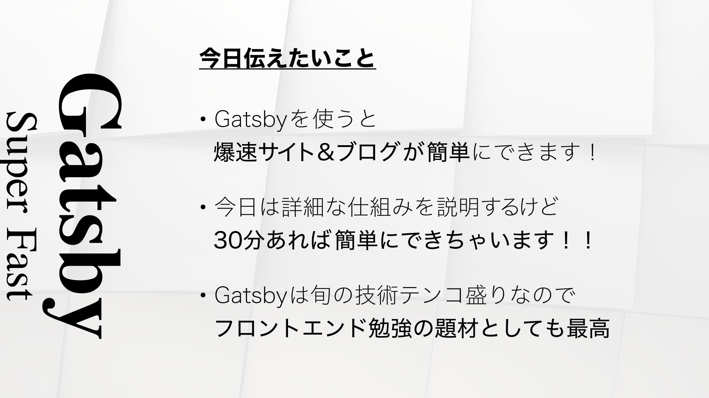
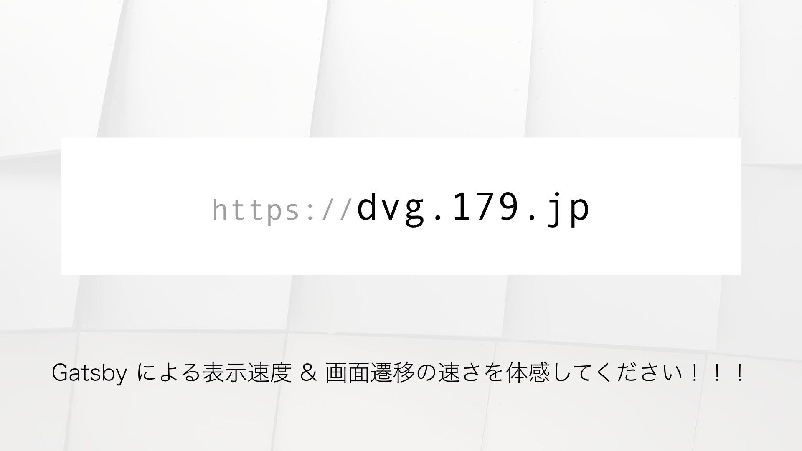

3月から [@kakakakakku 先生](http://kakakakakku.hatenablog.com) にお願いしていたブログメンターが4月で卒業となった。
もっと長い間メンターしてもらった気がするけれど、3月・4月の2ヶ月間だったのか。

@kakakakakku 先生こと吉田さんは、一週間に最低一回、多いときは何度も声をかけてくれる。
声をかけてくれる内容も、単純に「面白い」とか「良い」とかだけでなく、こちらがさらに学びを得られるようなフィードバックをもらえるので、ここ二ヶ月はとても濃密な、学びの多い時間を過ごせた。  
絶妙なタイミングでコミュニケーションを取ってくれ、コーチングをしてくれる吉田さんのメンタースキルはスゴくて、「これがコーチングか」というものかと効果を自分自身で実体験出来た。

今月の募集はいっぱいになってしまったみたいだけど、興味がある人は一度お願いしてみることを強くオススメする！
学びが多く、強い刺激を受けられること間違いない！

メンターをしてもらってから、3月はとても大きな成果が出せたけれど、4月はブログ（アウトプット）への注力をサボってしまい成果が全く出せなかった。
これからのためにもブログメンターしてもらった内容を振り返ってみる。

## テーマを相談する
メンターをしてもらえることになり、まず専門分野だったり興味のある技術、課題感などをヒアリングしてくれた。
専門はフロント寄りで、技術についてはフロントエンドとコーチング・チームビルディングとかに興味を持っていた。また、吉田さんのスゴイメンタースキルからも学びたいと思っていた。

ヒアリングしてもらい、アドバイスもらうまで GatsbyJS について登壇することも、ましてやブログに書くことも決まっていなかった。
吉田さんに「Gatsbyだけでも数記事書けるよ！」と言ってもらい、とりあえず Gatsby をテーマに書いてみた。書いてみると、自分が勉強したい技術が詰まっていて、順に取りあげていったら面白そうだと気づき、しばらく Gatsby をテーマに書こうと決めた。

確かに Gatsby 自体は面白そうだったけれど、吉田さんがブログの切り口の見本を教えてくれたことで、自分自身のテーマがクリアになった。自分だけでやっていると、テーマを決めるとかクリアにするって、できそうでできない。  
吉田さんにメンターしてもらうと、「ああ、自分はこれを目指したかった」というのがクリアにできて、とても面白い。この辺がやはり、名メンターのスキルなのだと思う。

## 記事に感謝する！
メンターしてもらって初めて記事を公開した時に言われたことが印象的だった。  

> そして重要なのは「自分のブログを読んでもらいたいと思う前に，人のブログをたくさん読んでフィードバックする」ってことですね！ブロガー同士，記事に感謝する気持ちが大切です！

フィードバックってこれまであまりしていなかった。  
でも、自分が書き手なら、ただ「読んだ」というツイートを見ただけでも嬉しい。
自分がされて嬉しいことを他人にもする。当たり前だけど、なかなかできないことが多い。

それ以来、できるだけするように心がけている。
ブログのいうメディアを盛り上げていく上でも、こういう心がけって本当に大事だと学んだ。

## 登壇に向けて、記事を書く
今年は社外でのアウトプット強化を目標にしていて、**登壇する**という目標も立てていた。  
メンターをしてもらい、背中を押してもらって KyotoJS に登壇を応募してしまった。

振り返ると、若干無茶な感じはするけど、この時の勢いに任せて思い切ったのは本当によかった。
自分一人だとコンフォートゾーンに留まりがち。攻めの**積極的な決断を後押ししてもらえる**のもメンターをしてもらう大きなメリットかもしれない。

また、登壇に向けて先に教えてもらっていた**ブログ記事→登壇スタイル**をできるだけ実践した。  

> お初情報を登壇でバーンと出すのではなく，記事としてちょこちょこ出していた内容を整理して登壇するというスタイルが一番良いです．

内容自体はブログで書きながら、準備できて本当によかった。  
次も機会があれば、今回の成功体験を活かして、必ずそうしたいと思う。

## アウトプットメンター
登壇するにあたり、図々しくも登壇資料のフィードバックも吉田さんにお願いしてしまったw  
発表前日に吉田さんに見てもらい、「今日伝えたいこと」と「 dvg.179.jp を見てください」のスライドを追加するという貴重なフィードバックをもらった。  

このスライドを追加することで、より分かりやすく、メッセージが明確にできて、本当に良かった。

ブログに収まらず、登壇まわりでも貴重なメンタリングをしてもらい、初登壇でも成功体験を積むことができた。
特に登壇資料の方は、はてブホットエントリーにも入ったし、予想を大きく超える成果に繋がった。これも、アウトプットメンターとしてフィードバックしてくれた吉田さんなしでは、成し得なかったと思う。

## 低迷
4月に入って、色々な言い訳（仕事が忙しくなった、子供が...）が思い浮かぶけど、ブログが低迷してしまった。
登壇が上手くいってしまって、記事を書くことに身構えるようになったのかもしれない。

吉田さんからも「今は構えず、細かく出しましょう」と言ってもらい、細かな記事をなんとか出していた。
振り返ってみると、リズムが出来てきたように思えて、実はまだ習慣化できていなかったのだと思う。

やっぱりどんなブログ書くにも準備は必要で、慣れていない自分だと余計に時間がかかる。  
一日で全てを仕上げるのではなく、一週間の中でリズムを持って書いていくことが重要だと学んだ。

また全て同じ熱量で書く必要もなく、簡単な記事などを書きながら時間を作り、検証など時間をかけた記事をあげれば良いことも学んだ。
わかっていながら、なかなか実践出来ていないので、この辺は今後計画を立てて実践していきたい。

## 学べたこと
今回メンタリングしてもらい、多くの刺激を受けることができた。

- コーチング（実際にメンタリングしてもらうことで、効果を体感した）
- ブログアウトプットのコツ
- 登壇、登壇の準備の仕方、いい登壇資料を作るためのノウハウ
などなど

たぶん教えてもらったことの半分もまだ身についていないと思うけど、少しずつでも実践して自分のものにしていきたい。

そして吉田さんの恐ろしいところは、教えてくれたことの大半はすでにブログエントリーとして存在する。
一日一日、一週間の積み重ねがとんでもなく分厚いサイトとして蓄積されている。アウトプットの熱帯雨林や！！！！

### コーチング
また、コーチングについては本を読んだりして学んでいるけれど、実際にコーチングをしてもらい、効果を実感出来たのは大きい。
吉田さんのコミュニケーションの取り方がズバ抜けて上手いのかもしれないけど、たくさんのやりとりをしている訳でもないのに、スッとやるべきことがクリアになる感覚はスゴかった。

一方的に教えてもらったり、学ぶ訳でもなく、何か上手く引き出してもらう感覚。  
コーチングってスゴイ。

## これから
メンタリングしてもらったことを時々思い出しながら、とにかくアウトプットを継続することを目標にして自走できるように頑張る！  
自走が厳しそうなら、kakakakakkuBot を非公式に作ったりしようかな。

なにはともあれ、メンターしていただいて、とても大きな刺激と学びを得ました！ありがとうございました！  
メンターをお願いするのを悩んでいる人がいたら、得るものしかないので、ぜひ来月以降やってみてください。