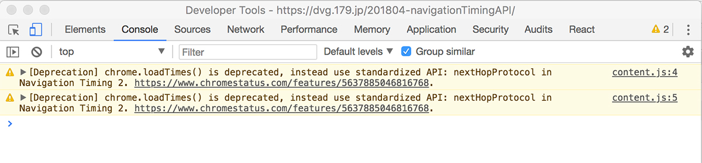

13日の金曜日、ドタバタしていてブログが書けずに焦ってます。  
書きたいテーマはあるのですが、まだまとまってなかったり、検証が済んでなかったり...  
年明けから Chrome に出るようになっていたアラートについて調べてみました。  

## Chrome DevTool に出るアラート
Chrome の DevTool を開くと、Console に常にアラートが2件。  
検証中とかにアラート出てると「え？なになに？」ってびっくりします。 



内容を読むと、サイトやアプリのエラーでないことはすぐわかります。

`[Deprecation] chrome.loadTimes() is deprecated, instead use standardized API: nextHopProtocol in Navigation Timing 2.`

「なんだ。よかった！」と思って放置してたけど、なんかずっとしつこく出てるし、どういうことなのか調べてみた。内容としては、「chrome.loadTimes() が非推奨になり、代わりに標準化された API である Navigation Timing 2 が使えるよ」というもの。  
他のブラウザに先行して`chrome.loadTimes() `として実装されていたものが標準化され、`Navigation Timing 2`APIとして複数のブラウザに実装されたので、Chrome もそっちを推奨にして、独自実装の`chrome.loadTimes() `は Chrome 64 で非推奨にするよということ。  
とてもいい話のような気がするから、アラート消してほしい。

<a href="https://developers.google.com/web/updates/2017/12/chrome-loadtimes-deprecated" target="_blank">Chrome 64 to deprecate 
the chrome.loadTimes() API</a>


## Navigation Timing 2
上記の Chrome のブログの方で代替する書き方について解説されているが、せっかくなので <a href="https://codesandbox.io/" target="_blank">CodeSandbox</a> 使って試してみた。 

CodeSandbox は前回取り上げた Scrimba のエディター部分を取り出したようなサービスで、HotReload もガンガン効いてとても楽しい。
今回のようなことを試すときも、簡単に環境が出来上がっているところに、コードだけ書けるのでスゴく楽。

### chrome.loadTimes()

```JS
// Chrome LoadTimes
console.log(chrome.loadTimes());
/*
{
  requestTime: 1523548223.987
  startLoadTime: 1523548223.987
  commitLoadTime: 1523548224.318
  finishDocumentLoadTime: 1523548229.698
  finishLoadTime: 1523548229.699
  firstPaintTime: 1523548232.456
  firstPaintAfterLoadTime: 0
  navigationType: "Other"
  wasFetchedViaSpdy: false
  wasNpnNegotiated: false
  npnNegotiatedProtocol: ""
  wasAlternateProtocolAvailable: false
  connectionInfo: "unknown"
}
*/
```

まずは `Chrome.loadTimes()`。  
オブジェクトでまとめて返ってくるからとても手軽。


### Navigation Timing 2

```JS
const pt = window.performance.timing;
const fpEntry = performance.getEntriesByType('paint')[0];
const ntEntry = performance.getEntriesByType('navigation')[0];
const loadTimes = {
  requestTime: pt.navigationStart / 1000,
  startLoadTime: pt.loadEventStart / 1000,
  commitLoadTime: pt.responseStart / 1000,
  finishDocumentLoadTime: pt.domContentLoadedEventEnd / 1000,
  finishLoadTime: pt.loadEventEnd / 1000,
  firstPaintTime: (fpEntry.startTime + performance.timeOrigin) / 1000,
  firstPaintAfterLoadTime: 0,
  navigationType: ntEntry.type,
  wasFetchedViaSpdy: ['h2', 'hq'].includes(ntEntry.nextHopProtocol),
  wasNpnNegotiated: ['h2', 'hq'].includes(ntEntry.nextHopProtocol),
  npnNegotiatedProtocol: ['h2', 'hq'].includes(ntEntry.nextHopProtocol) ?
        ntEntry.nextHopProtocol : 'unknown',
  wasAlternateProtocolAvailable: false,
  connectionInfo: ntEntry.nextHopProtocol,
};
console.log(loadTimes);
/*
{
  requestTime: 1523548223.987
  startLoadTime: 1523548229.698
  commitLoadTime: 1523548224.318
  finishDocumentLoadTime: 1523548229.698
  finishLoadTime: 1523548229.699
  firstPaintTime: 1523548232.468344
  firstPaintAfterLoadTime: 0
  navigationType: "navigate"
  wasFetchedViaSpdy: true
  wasNpnNegotiated: true
  npnNegotiatedProtocol: "h2"
  wasAlternateProtocolAvailable: false
  connectionInfo: "h2"
}
*/
```

続いて標準化された実装の `Navigation Timing 2`。  
`Chrome.loadTimes()` が UNIX TIME として返すのに対して、新しい `Navigation Timing 2` の方はページの の time origin を起点とした ミリ秒 で返されるため、少し違うもののようです。

```
// Chrome.loadTimes()
{
  requestTime: 1523548223.987
  startLoadTime: 1523548223.987
  commitLoadTime: 1523548224.318
  finishDocumentLoadTime: 1523548229.698
  finishLoadTime: 1523548229.699
  firstPaintTime: 1523548232.456
  firstPaintAfterLoadTime: 0
  navigationType: "Other"
  wasFetchedViaSpdy: false
  wasNpnNegotiated: false
  npnNegotiatedProtocol: ""
  wasAlternateProtocolAvailable: false
  connectionInfo: "unknown"
}
// Navigation Timing 2
{
  requestTime: 1523548223.987
  startLoadTime: 1523548229.698
  commitLoadTime: 1523548224.318
  finishDocumentLoadTime: 1523548229.698
  finishLoadTime: 1523548229.699
  firstPaintTime: 1523548232.468344
  firstPaintAfterLoadTime: 0
  navigationType: "navigate"
  wasFetchedViaSpdy: true
  wasNpnNegotiated: true
  npnNegotiatedProtocol: "h2"
  wasAlternateProtocolAvailable: false
  connectionInfo: "h2"
}
```

数字の部分は `startLoadTime` や `firstPaintTime` が誤差的なところで若干違うものの、ほぼ同じ。  
文字列の返ってくる項目は、両者で違うものの、`Navigation Timing 2`の方が正確そうな値が入っている。


## まとめ
Chrome に出ているアラートは特に問題ない。  
新しい API によってほぼ同じデータが取得可能。

13日の金曜日の不安を少し和らげるかもしれない小ネタでした。
