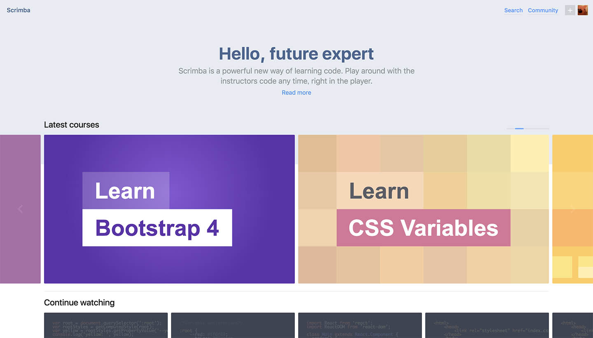
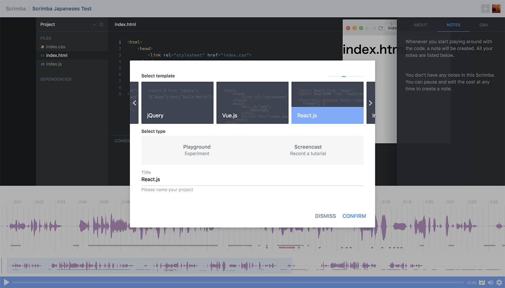
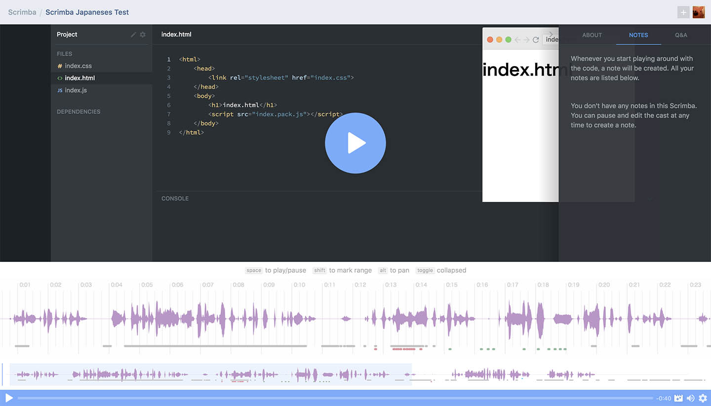
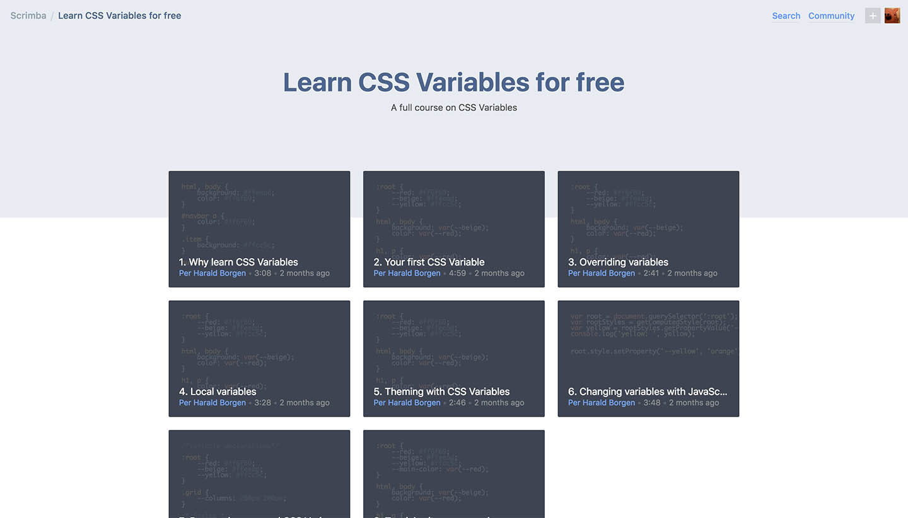

Gatsby の資料にも盛りこんでいたが Frontend Handbook 2018 を読んだ。  
Frontend Handbook は JSマスターな Cody Lindley 氏による 2018 年のフロントエンドの展望がまとめられたもの。
その中で知らない or 名前しか知らないサービス・ライブラリ、キーワードなどいくつか出てきた。

- scrimba
- turbo 
- sapper
- mobx
- prepack.io

今回は上記のうち、Scrimba というサービスがフロントエンドの素振り環境として優秀で、説明をする側・説明をされる側双方にとってわかりやすいプラットフォームだったので記事にしてみる。


## Scrimba
Scrimba は CodePen とドットインストールが混ざったような、共有&学習プロットホーム。  



ドットインストールとの違いは、画面全体で動画が展開され、かつ講義中の画面がインタラクティブな点が大きい。  
講義自体がテキストエディターで行われ、いつでも講義中のコードを自分で編集ができてしまう。（コードの編集を行うと講義は一時停止される）
「あれ？」って思った時に、自分の気になっているコード部分を見れるのがとても便利。  
また、画面右側はコードの内容をすぐにプレビューできるから、変更がどう影響するのかわかりやすい。（CSSなどはリアルタイムに反映されるが、HTMLやJSファイルを変更した場合はプレビュー上のリロードボタンを押さないと変更されない）

ちなみに Frontend Handbook 2018 の中で Scrimba は Recap of Front-end Development in 2017 の項に書かれていた。2018年ではなく、すでに2017年に大きく認知されいるものだったw

ドットインストールのような動画で見ると、内容がわかりやすい。  
けど実際手を動かし始めると、わかった気になっていただけで、何もわかっていない・覚えていないことも多い。  
その点、CodePen のようなエディター & 実行環境が用意されていると、「見る → 触ってみる → 理解する」という流れになりやすいように思う。

ただの動画だけではなく、画面全体を学ぶツールとして構築しているのがよくできているなぁと関心した！


## Scrimba でできること
Scrimba の動画とそれに付随する Playground はログインなしでも気軽にみることができる。  
ログインは GitHub アカウント or メールアドレスで可能のようだ。

公開されている動画の総数は分からないけど、キーワードでの検索が可能。`JS`という検索だと 79件だった。
おそらく Top に並んでいるのがオフィシャルで作っている動画っぽい。

ログインすると Playground が使えたり、動画の投稿ができるようになる。  



環境のテンプレートは以下が用意されていた。

- Imba
- JavaScript
- HTML, CSS, JS
- Angular
- jQuery
- Vue.js
- React.js

またそれぞれの環境には npm モジュールを自由に追加できるようで、オンライン素振り環境としても優秀かも。
`package.json`をインポートすることも可能みたいなので、フロントエンドの環境なら簡単に作れる。  
また記述したファイル自体も zip でダウンロードできるようだった。

先日 <a href="https://codesandbox.io/" target="_blank">CodeSandbox</a> というサービスがはてブの記事に上がっていたけど、エディター部分はあれと同じような機能が搭載されている。

何かのライブラリの説明やメンバー共有用に使えればとても便利そう。あとスライドとかの Demo 用にも便利かもしれない。


## Scrimba で録画してみた
公開まわりの説明が見当たらなかったので、実際に録画・録音して、公開してみた。    
<a href="https://scrimba.com/c/cPyK9hv" target="_blank">→ Scrimba テスト</a>


### 録画・録音
録画と録音はとても簡単にできる。  
（Chrome と Firefox のみ録音に対応していない模様。）

再録音の方法が分からなくて、少し悩んだけれど、タイムラインのバーを希望の位置までドラッグして録音ボタンを押すことで簡単にできる。  
上書きする場合はアラートが出るので、一度仕組みがわかると直感的に操作できる。



操作方法はよく分からないけれど、音の波形を見たり、編集したりもできるみたい。
MacBookの内蔵マイクでもそこそこきれいに聞こえる録音ができた。


### 公開状態
公開の状態は3つから選べる。  
画面左側の Project の鉛筆マークを押すと変更できる。  
状態の説明は試してみた結果、どうもそういうことみたい。

- Private（自分しか見えない）
- Secret（URLを知っている人しか見えない）
- Public

こういう動画 + 簡易的な実行環境があると、すごくわかりやすく、時間差のあるメンバー共有とかにも有効かもしれない。
会社で使えたら、ドキュメントだけよりもわかりやすいかなと思ったけど、セキュリティが厳しい会社だと難しいかな。


## CSS Variables の Screencast を見た
Topページのカルーセルに並んでいるオフィシャル Screencast の CSS Variables を見た。  
全部で 8 個の Screencast で構成されていて一つ 3 分くらい。



普段 CSS 書くときは Sass を使っているから、CSS 内でも変数を使うのは日常的。
「CSS 標準で入っても使うメリットない」と思ったんだけど、CSS Variables は JS から CSS Variables 自体を書き換えることを知った。  

```CSS
:root {
    --red: #ff6f69;
    --beige: #ffeead;
    --yellow: #FFF;
}
```

```JS
var root = document.querySelector(':root');
var rootStyles = getComputedStyle(root);
var red = rootStyles.getPropertyValue('--red');
root.style.setProperty('--red', 'green');
```

エラーとか完了とかの状態に合わせて、テーマカラーを変えるのとかに便利そう。  
もちろん `root` にクラス振るとかでも代用できるし、そちらの方がいい設計な気もするけど、有効な場合もありそうな気がする。

今回の例は特に Scrimba の形式が有効だなぁと思った。
- Screencast を見る
- 「え？本当に？？JSから変えれんの？」
- 画面をクリックして Playground 状態にする
- 適当に書き換える
- 納得する
やっぱり自分で触れると、吸収力が違う気がする。


## まとめ
フロントエンドの簡単な Playground 環境としても優秀な Scrimba を実際に試してみた。  
動画（Screencast） も簡単に撮れて、全体公開以外の方法も選べて、とても便利に使えそう。

Scrimba で見る場合も、内容を見て、疑問に思ったところや気になるところで、すぐに試すことができるのでとても有効だと思った！
